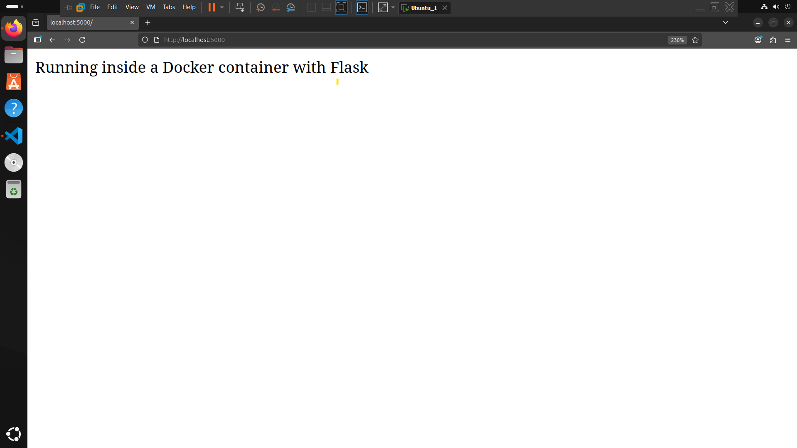

# Dockerized Flask Demo 🐳

A simple project to demonstrate running a Flask web application inside a Docker container.
The goal is to build a minimal Flask app, containerize it, and run it locally.

---

## 📂 Project Structure

```
flask-docker-demo/
 ├── app.py
 └── Dockerfile
      
```

---

## ⚙️ Steps to Run

1️⃣ Clone the Repository

```bash
git clone https://github.com/Eng-Mahmoud-Walid/Flask-Docker-Project.git

cd Flask-Docker-Project
```

2️⃣ Build the Docker Image

```bash
docker build -t flask-demo .
```

3️⃣ Run the Container

```bash
docker run -d -p 5000:5000 flask-demo
```

4️⃣ Open the App
Visit in your browser: 👉 [http://localhost:5000](http://localhost:5000)
You should see:



---

## 🐳 Dockerfile Explained

```dockerfile
FROM python:latest       # Base Python image
WORKDIR /app                # Set working directory
COPY app.py /app            # Copy Flask app
RUN pip install flask       # Install Flask
EXPOSE 5000                 # Expose port 5000
CMD ["python", "app.py"]  # Run the app
```

**Explanation:**

* `FROM` → base image
* `WORKDIR` → sets working directory inside container
* `COPY` → copies app files into container
* `RUN` → installs Flask
* `EXPOSE` → allows external access on port 5000
* `CMD` → command to start the app

---

## 🎯 What You’ll Learn

* How to run a Flask web app in Docker
* How to build and run a Docker image
* How to expose container ports to host

